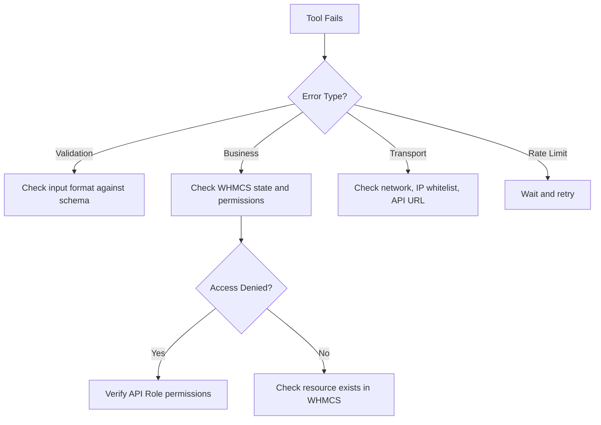

# WHMCS MCP Server - Development Specification

> **Note:** This document is the **original full build specification** (tool-by-tool). For current repo orientation — governance, write-flow, env vars, scripts, and doc map — use **[AGENTS.md](AGENTS.md)** and **[README.md](README.md)** first. Archived earlier drafts: [docs/archive/](docs/archive/).

> This document serves as the complete specification for building a production-ready Model Context Protocol (MCP) server that enables AI agents to administrate WHMCS installations.

## Common MCP Failure Modes (Lessons Learned)

From real MCP usage, the most common failure modes are:

- **Logging to stdout in stdio servers** – Corrupts JSON-RPC and breaks the server. Logs must go to stderr or another sink.
- **Bad error surfaces** – Throwing generic exceptions instead of returning structured `isError: true` tool results, preventing model recovery.
- **Timeouts + oversized responses** – Tools returning huge payloads (full DB dumps, entire file systems) that hit buffer or time limits.
- **Overpowered servers with no least-privilege** – Everything exposed, no per-tool control, often connected from untrusted hosts.
- **Ambiguous tool descriptions & unversioned schemas** – Models miscall tools or keep using old shapes after changes.
- **Weak maintenance & no tests/docs** – Servers ship once and then silently rot, causing subtle production issues.

---

## 1. Tech Stack & Project Layout

**Requirements:**

- Use **TypeScript**
- Use **@modelcontextprotocol/sdk** for MCP integration
- Use **zod** for all schema validation
- Use **axios** for HTTP transport
- Use **dotenv** for configuration
- Use **StdioServerTransport** as the MCP transport (for Cursor compatibility)
- Respect MCP stdio logging constraints (no logs to stdout; logs only to stderr or other sinks)

**Project Structure:**

```
src/
├── index.ts                     # MCP server entry point
├── config.ts                    # env + configuration validation
├── logging.ts                   # logger utility (stderr only)
├── rateLimiter.ts               # rate limiting & idempotency helper
├── whmcs/
│   ├── WhmcsClient.ts           # WHMCS API wrapper class
│   └── normalizers.ts           # JSON / array normalization helpers
├── tools/
│   ├── clients.ts               # client tools
│   ├── billing.ts               # invoice & payments tools
│   ├── orders.ts                # products & orders tools
│   ├── services.ts              # service lifecycle tools
│   ├── domains.ts               # domain tools
│   └── support.ts               # ticket tools
├── resources/
│   └── index.ts                 # MCP resources
└── playbook/
    └── whmcsOpsPlaybook.ts      # human-readable playbook text resource
```

**TypeScript Config:** Use `tsconfig.json` with strict TypeScript settings (`strict=true`, ES2020+, `moduleResolution=node`).

---

## 2. Core Context & Constraints

### 2.1 Authentication

- WHMCS External API uses POST parameters: `identifier` and `secret` (API Authentication Credentials)
- **Do NOT** use legacy admin username + MD5 password
- Base endpoint: `${WHMCS_API_URL}/includes/api.php`

#### 2.1.1 Security Best Practices

> [!IMPORTANT]
> API credentials should be treated as highly sensitive secrets.

**Credential Management:**

- Store credentials in environment variables, never in code
- Rotate API secrets periodically
- Use dedicated API credentials per integration (not shared with other systems)
- API credentials are decoupled from human admin accounts, enabling independent auditing

**Role-Based Access Control (RBAC):**

- WHMCS allows API credentials to be restricted to specific API Roles
- The MCP server must handle `403 Forbidden` or `"Access Denied"` responses gracefully
- Return structured errors: `"Tool execution failed: Insufficient API permissions for this credential set."`
- This allows the AI to inform users of permission limitations rather than crashing

**IP Whitelisting:**

- WHMCS restricts API access by IP address in General Settings → Security
- In distributed environments (dynamic IPs, dev laptops), consider:
  - Using a VPN with static IP
  - Running the MCP server in a container with whitelisted egress IP
  - Configuring WHMCS to allow the server's IP range
- **This is the most common cause of integration failure** – check IP restrictions first when debugging

### 2.2 Transport

Use `axios` with:

- Base URL from env var `WHMCS_API_URL`
- Reasonable timeout
- POST requests with `application/x-www-form-urlencoded` form data
- Minimal **retry policy** (e.g., small number of retries on transient network errors or 5xx responses) with backoff
- **Never** retry non-idempotent commands blindly

### 2.3 Response & Error Handling

> [!IMPORTANT]
> WHMCS often returns HTTP `200 OK` even when the API call fails.

JSON body contains a `result` field with values like `"success"` or `"error"`.

**Rules:**

- If HTTP status != 200, treat as **protocol/transport error** → map to JSON-RPC error
- If `data.result === 'error'`, treat as **tool execution error** → surface via MCP tool result with `isError: true`
- Normalize JSON anomalies:
  - List fields may be: `[]`, `{}`, or `{"0": {...}, "1": {...}}`
  - Provide utility functions to transform these into proper arrays before passing to zod schemas

### 2.4 Boolean Handling

- Zod schemas expose booleans as `true/false`
- Internally, map to what WHMCS expects (usually `1/0` or `"true"/"false"`)

### 2.5 Response Size / Pagination

- Avoid giant payloads that can cause host timeouts or buffer issues
- Enforce reasonable page sizes (e.g., max 100 records)
- Respect configurable `MCP_MAX_PAGE_SIZE`
- Always support pagination for list tools
- **Never** dump arbitrarily large datasets in a single tool response

### 2.6 Performance & Latency Optimization

> [!TIP]
> WHMCS API calls incur network latency, TCP overhead, and PHP bootstrap time per request.

**Optimization Strategies:**

1. **Batch Data Retrieval**: Use search/list endpoints instead of fetching items one-by-one
2. **Parallel Execution**: When forced to make multiple calls, use `Promise.all()` for concurrent requests
3. **Lightweight First**: Use summary tools (`search_clients`) before detail tools (`get_client_details`)
4. **Response Filtering**: Strip unnecessary fields server-side to reduce payload size

**Example Anti-Pattern:**

```typescript
// ❌ BAD: 10 sequential HTTP round-trips
for (const id of invoiceIds) {
  await getInvoice(id);
}

// ✅ GOOD: Parallel execution
await Promise.all(invoiceIds.map((id) => getInvoice(id)));
```

---

## 3. Global Safety, Modes, Rate Limiting, Logging & Tool Scopes

### 3.1 Operation Modes

Use env var `MCP_MODE`:

| Mode        | Behavior                                                                             |
| ----------- | ------------------------------------------------------------------------------------ |
| `read_only` | Only non-mutating tools execute. Mutating tools return `isError: true`.              |
| `simulate`  | Mutating tools log intended action and return mocked success, but DO NOT call WHMCS. |
| `full`      | All tools execute real WHMCS actions.                                                |

Each tool must include an internal `isMutating` flag.

### 3.2 Tool Allowlist / Principle of Least Privilege

- Use env var `MCP_TOOL_ALLOWLIST` (comma-separated tool names)
- At registration, only register tools in the allowlist (if set)
- If `MCP_TOOL_ALLOWLIST` is empty/unset, register all tools

### 3.3 Rate Limiting & Idempotency

**Rate Limiting:**

- Env var: `MCP_RATE_LIMIT` (max WHMCS calls per second, global)
- If limit exceeded, return `isError: true` with message `"Rate limit exceeded"`

**Idempotency for High-Risk Tools:**

- `capture_payment`
- `record_refund`
- `accept_order`
- `terminate_service`

Implementation:

- Derive key from `(tool_name + primary_id + time_bucket)`
- Keep small in-memory map of recent keys and results
- Within configured window (30–60 seconds), return cached result instead of re-executing

### 3.4 Logging (stderr only)

Create `logging.ts`:

- Write to **stderr** only (use `console.error` or `process.stderr.write`)
- **NEVER** write to stdout (reserved for JSON-RPC)
- Log fields:
  - Tool name
  - Inputs (secrets redacted)
  - `isMutating`
  - WHMCS action & params (redacted)
  - Result or error summary
  - `correlationId` (UUID)

Use env var `MCP_DEBUG`:

- `true`: verbose logging
- `false`: minimal logging

---

## 4. Configuration Validation

Create `config.ts`:

```typescript
// Environment Variables (validated with zod)
interface AppConfig {
  WHMCS_API_URL: string; // Required
  WHMCS_IDENTIFIER: string; // Required
  WHMCS_SECRET: string; // Required
  MCP_MODE: "read_only" | "simulate" | "full"; // Default: 'read_only'
  MCP_RATE_LIMIT?: number; // Optional, with default
  MCP_DEBUG: boolean; // Default: false
  MCP_MAX_PAGE_SIZE?: number; // Default: 100
  MCP_TOOL_ALLOWLIST?: string; // Comma-separated tool names
}
```

- Load via `dotenv`
- Validate with zod
- Fail fast at startup if required env is missing/invalid
- Export typed `AppConfig` object

---

## 5. WHMCS Client Abstraction

Create `WhmcsClient` in `whmcs/WhmcsClient.ts`:

```typescript
class WhmcsClient {
  constructor(config: AppConfig, logger: Logger, mode: McpMode);

  call<T>(
    action: string,
    params: Record<string, any>,
    options?: {
      normalizerKey?: string;
      simulate?: boolean;
      isMutating?: boolean;
    }
  ): Promise<T>;
}
```

**Inside `call`:**

- Honor `MCP_MODE`:
  - If `mode === 'simulate'` and `options.isMutating`, log and return mocked result
- Normalize booleans to strings/ints as required by WHMCS
- Apply array/object normalization using `normalizers.ts`
- Handle HTTP errors (non-200) as protocol-level errors
- Handle WHMCS business failures (`result === 'error'`) by throwing `WhmcsBusinessError`:

```typescript
interface WhmcsBusinessError {
  code?: string | number;
  message: string;
  details?: any;
}
```

Create `normalizers.ts` with helpers for: `clients`, `invoices`, `items`, `transactions`, `tickets`, etc.

---

## 6. MCP Server Setup (index.ts)

In `src/index.ts`:

1. Initialize config and logger
2. Create `WhmcsClient` instance
3. Use `@modelcontextprotocol/sdk` to create server with `StdioServerTransport`
4. Register tools from modules (applying `MCP_TOOL_ALLOWLIST` filter)
5. Register resources from `resources/index.ts`

**For each tool:**

- Provide:

  - `name`
  - `description` (include schema version, e.g., `"Version: v1"`)
  - `inputSchema` (zod → JSON Schema)
  - `outputSchema` (optional)

- In implementation, catch:
  - Validation errors (zod) → return `isError: true`
  - `WhmcsBusinessError` → map to `isError: true`
  - Only use JSON-RPC errors for protocol-level issues

### 6.1 Tool Descriptions as Prompt Engineering

> [!IMPORTANT]
> Tool descriptions are consumed directly by the LLM. Poor descriptions lead to poor AI performance.

**Description Best Practices:**

```typescript
// ❌ BAD: Too vague
"Adds a client."

// ✅ GOOD: Business rules included
"Creates a new client account. Requires first name, last name, and email.
 Optional fields include address and phone. Returns the new Client ID.
 If no password is provided, one will be auto-generated. Version: v1"
```

### 6.2 Composite Tool Pattern

Some operations require multiple WHMCS API calls. These are "Composite Tools":

| Tool                         | API Calls                                                  | Why Composite        |
| ---------------------------- | ---------------------------------------------------------- | -------------------- |
| `record_refund`              | `GetInvoice` + `AddTransaction` + optional `UpdateInvoice` | No native refund API |
| `create_client` (reuse mode) | `GetClients` + conditional `AddClient`                     | Deduplication logic  |

**Implementation Pattern:**

```typescript
async function compositeRefund(invoiceid, amount) {
  // 1. Fetch current state
  const invoice = await whmcs.read('GetInvoice', { invoiceid });

  // 2. Validate business rules
  if (amount > invoice.paidAmount) throw new Error('Cannot refund more than paid');

  // 3. Execute operation
  await whmcs.mutate('AddTransaction', { ... });

  // 4. Update status if needed
  if (fullyRefunded) await whmcs.mutate('UpdateInvoice', { status: 'Refunded' });
}
```

---

## 7. Tools – Detailed Specifications

### 7.1 Client Management

#### Tool: `create_client`

**Purpose:** Create a WHMCS client or reuse existing by email.

**Inputs:**

| Parameter       | Type             | Required | Description                                      |
| --------------- | ---------------- | -------- | ------------------------------------------------ |
| `firstname`     | string           | Yes      | Minimum 1 char                                   |
| `lastname`      | string           | Yes      | Minimum 1 char                                   |
| `email`         | string (email)   | Yes      | Valid email                                      |
| `country`       | string (2 chars) | Yes      | ISO-3166-1 alpha-2                               |
| `company`       | string           | No       | Company name                                     |
| `address1`      | string           | No       | Street address                                   |
| `city`          | string           | No       | City                                             |
| `state`         | string           | No       | State/Province                                   |
| `postcode`      | string           | No       | Postal code                                      |
| `phonenumber`   | string           | No       | Phone number                                     |
| `password`      | string           | No       | Account password                                 |
| `owner_user_id` | number           | No       | Owner user ID                                    |
| `mode`          | enum             | No       | `'create_only'` or `'reuse_if_exists'` (default) |

**Behavior:**

- If `mode === 'reuse_if_exists'`: Search by email first, return existing client if found
- Otherwise: Call `AddClient` (generate password if missing)
- **Return:** `{ clientid: number, created: boolean }`
- **isMutating:** `true`

> [!NOTE] > **WHMCS 8+ User vs Client Model:**
>
> - **User**: Entity that can log in (authentication)
> - **Client**: Entity that owns products and pays bills
> - One User can manage multiple Clients
> - If `owner_user_id` is omitted, WHMCS creates a new User automatically
> - To add a Client to an existing User, provide `owner_user_id`

---

#### Tool: `search_clients`

**Inputs:** `search` (optional), `limit` (default 25, max `MCP_MAX_PAGE_SIZE`), `offset` (default 0)

**Return:** `{ clientid, firstname, lastname, email, companyname }[]`

**isMutating:** `false`

---

#### Tool: `get_client_details`

**Inputs:** `clientid` (required)

**Return:** Full client details including credit balance, product/domain counts, custom fields

**isMutating:** `false`

---

#### Tool: `update_client`

**Inputs:** `clientid` (required), optional fields to update (`firstname`, `lastname`, `email`, `companyname`, `address1`, `address2`, `city`, `state`, `postcode`, `country`, `phonenumber`, `notes`)

**Behavior:**

- Only updates provided fields
- sanitizes text inputs
- normalizes email

**isMutating:** `true`

---

#### Tool: `get_service_details`

**Inputs:** `serviceid` (required)

**Return:** `{ serviceid, clientid, domain, status, product, billing_cycle, next_due_date, amount, payment_method, ... }` including custom fields and config options.

**isMutating:** `false`

### 7.2 Billing & Financial Operations

#### Tool: `get_invoice`

**Inputs:** `invoiceid` (required)

**Return:** Invoice with status, total, balance, dates, line items, transactions

**isMutating:** `false`

---

#### Tool: `mark_invoice_paid`

**Inputs:** `invoiceid` (required)

**Behavior:**

- Fetch invoice first
- If status ≠ `Unpaid`, return `isError: true`
- Call `UpdateInvoice` with `status='Paid'`

**isMutating:** `true`

---

#### Tool: `record_refund`

**Inputs:** `invoiceid`, `amount` (> 0), `refund_type` (`'Credit'` or `'GatewayRecord'`), `reason` (optional)

> [!CAUTION]
> This tool ONLY records the refund inside WHMCS. It does NOT trigger any actual refund at the payment gateway (Stripe/PayPal/etc). The gateway reversal must be done manually.

**Behavior:**

- Validate `amount <= max_refundable_amount`
- For `Credit`: Add credit transaction
- For `GatewayRecord`: Add outbound transaction with `REFUND-{invoiceid}-{timestamp}` ID

**Return:** `{ invoiceid, amount, refund_type, new_invoice_status, note }`

**isMutating:** `true`

---

#### Tool: `capture_payment`

**Inputs:** `invoiceid`, `cvv` (optional), `force` (default false)

**Behavior:**

- Ensure `status === 'Unpaid'` and `balance > 0`
- Check for recent failed captures (unless `force=true`)
- Call `CapturePayment`

**Return:** `{ success, gateway_response, new_status }`

**isMutating:** `true`

---

---

#### Tool: `create_invoice`

**Inputs:** `userid` (required), `paymentmethod` (optional), `sendinvoice` (default false), `items` (array of `{ description, amount, taxed }`)

**Return:** `{ success, invoiceid, status, items_count, email_sent }`

**isMutating:** `true`

---

#### Tool: `add_credit`

**Inputs:** `clientid` (required), `amount` (required), `description` (default "Credit added via API")

**Return:** `{ clientid, success, amount_added, new_balance }`

**isMutating:** `true`

---

#### Tool: `apply_credit`

**Inputs:** `invoiceid` (required), `amount` (optional - defaults to max available/needed)

**Return:** `{ invoiceid, success, amount_applied, invoice_paid }`

**isMutating:** `true`

### 7.3 Product & Order Management

#### Tool: `list_products`

**Inputs:** `group_id`, `name_contains`, `include_hidden` (default false), `limit` (default 50)

**Return:** `{ id, name, group_name, description, type, isHidden }[]`

**isMutating:** `false`

---

#### Tool: `accept_order`

**Inputs:** `orderid`, `autosetup` (default true), `sendemail` (default true), `serverid` (optional)

> [!WARNING]
> If `autosetup` is true, WHMCS will attempt to contact the provisioning server and may fail if it is offline.

**Return:** `{ orderid, status }`

**isMutating:** `true`

---

### 7.4 Service Lifecycle

#### Tool: `suspend_service`

**Inputs:** `serviceid`, `reason` (optional)

**isMutating:** `true`

---

#### Tool: `unsuspend_service`

**Inputs:** `serviceid`

**isMutating:** `true`

---

#### Tool: `terminate_service`

**Inputs:** `serviceid`, `confirm` (must be true)

**Behavior:**

- If `confirm !== true`, return `isError: true`
- Check for unpaid invoices (warn or block)

**isMutating:** `true`

---

### 7.5 Domain Operations

#### Tool: `check_domain_availability`

**Inputs:** `domain` (e.g., "example.com")

**Return:** `{ status: 'available' | 'unavailable' | 'unknown', raw_status, reason? }`

**isMutating:** `false`

---

---

#### Tool: `register_domain`

**Inputs:** `domainid` (required), `nameserver1`...`nameserver4` (optional)

**Return:** `{ domainid, success, message }`

**isMutating:** `true`

---

#### Tool: `renew_domain`

**Inputs:** `domainid` (required)

**Return:** `{ domainid, success, message }`

**isMutating:** `true`

---

#### Tool: `transfer_domain`

**Inputs:** `domainid` (required), `eppcode` (optional)

**Return:** `{ domainid, success, message }`

**isMutating:** `true`

---

#### Tool: `sync_domain`

**Inputs:** `domainid` (required)

**Return:** `{ domainid, success, expiry_date, active, message }`

**isMutating:** `true`

### 7.6 Support & Ticketing

#### Tool: `create_ticket`

**Inputs:** `deptid`, `subject`, `message`, `clientid` (optional), `priority` (default 'Medium'), `markdown` (default true), `related_service_id` (optional)

**Return:** `{ ticketid, deptid, subject, status }`

**isMutating:** `true`

---

#### Tool: `reply_ticket`

**Inputs:** `ticketid`, `message`, `type` (`'Client'` | `'AdminNote'` | `'AdminPublic'`), `status_after_reply` (optional)

**Return:** `{ ticketid, status }`

**isMutating:** `true`

---

---

#### Tool: `get_ticket_departments`

**Inputs:** None

**Return:** `{ total, departments: [{ id, name, description, ... }] }`

**isMutating:** `false`

## 8. MCP Resources

Expose read-only resources for passive LLM context:

| Resource URI                           | Returns                                    |
| -------------------------------------- | ------------------------------------------ |
| `whmcs://clients/{clientid}/summary`   | Basic identity, credit balance, counts     |
| `whmcs://clients/{clientid}/log`       | Recent activity (orders, payments, etc.)   |
| `whmcs://invoices/{invoiceid}/history` | Invoice data, transactions, status changes |
| `whmcs://tickets/{ticketid}/thread`    | Full ticket thread with messages           |
| `whmcs://system/activity`              | Recent global system activity              |

Implement in `resources/index.ts` using `WhmcsClient`.

---

## 9. WHMCS Ops Playbook

Create `playbook/whmcsOpsPlaybook.ts` exposed as `whmcs://docs/ops-playbook`:

**Guidelines:**

- **Always search before creating:** Use `search_clients` before `create_client`
- **Billing disputes:**
  - Call `get_invoice` before financial actions
  - Prefer `record_refund` with `refund_type='Credit'` for simple disputes
  - State that gateway refunds must be done manually
- **Payments:** Use `capture_payment` only if invoice is `Unpaid`
- **Dangerous operations:**
  - Prefer `suspend_service` over `terminate_service`
  - For large transactions, add `AdminNote` and wait for human review

---

## 10. Schema Versioning & Maintainability

- Each tool declares internal `TOOL_VERSION = "v1"`
- Include version in tool description: `"Version: v1"`
- Design for future versions as separate tools (e.g., `create_client_v2`)
- Keep descriptions precise and aligned with schemas

---

## 11. Coding Standards & Testability

- **All** tool parameters/outputs validated with zod
- **No `any` types** – use explicit interfaces
- Add JSDoc comments for `WhmcsClient` methods and tool behaviors
- Structure code for easy unit testing
- Separate business logic from MCP/IO concerns

---

## 12. Error Handling Taxonomy

### 12.1 Error Categories

| Error Type           | Source               | Handling                                        |
| -------------------- | -------------------- | ----------------------------------------------- |
| **Validation Error** | Zod schema           | Return `isError: true` with field-level details |
| **Business Error**   | WHMCS `result=error` | Map to tool error, preserve message             |
| **Transport Error**  | Network/HTTP         | Map to JSON-RPC error                           |
| **Permission Error** | WHMCS RBAC           | Return structured permission message            |
| **Rate Limit Error** | MCP server           | Return `isError: true` with retry guidance      |

### 12.2 Common Error Messages

| Error                    | Cause                | Resolution                                |
| ------------------------ | -------------------- | ----------------------------------------- |
| `"Client Not Found"`     | Invalid `clientid`   | Verify ID with `search_clients`           |
| `"Domain not available"` | TLD not configured   | Check WHMCS whois.json configuration      |
| `"Access Denied"`        | API role restriction | Use credentials with required permissions |
| `"Payment Declined"`     | Gateway rejection    | Check card details, try later             |
| `"Product Not Found"`    | Invalid `pid`        | Use `list_products` to get valid IDs      |

### 12.3 Troubleshooting Guide



---

## Environment Variables Summary

> **Authoritative env-var reference:** see `README.md` (Configuration section) and [`docs/reference/agent-context.md`](docs/reference/agent-context.md). The table below is the original build-spec snapshot.

| Variable             | Required | Default     | Description                   |
| -------------------- | -------- | ----------- | ----------------------------- |
| `WHMCS_API_URL`      | Yes      | -           | WHMCS API base URL            |
| `WHMCS_IDENTIFIER`   | Yes      | -           | API identifier                |
| `WHMCS_SECRET`       | Yes      | -           | API secret                    |
| `MCP_MODE`           | No       | `read_only` | Operation mode                |
| `MCP_RATE_LIMIT`     | No       | `10`        | Max API calls/second          |
| `MCP_DEBUG`          | No       | `false`     | Verbose logging               |
| `MCP_MAX_PAGE_SIZE`  | No       | `100`       | Max pagination size           |
| `MCP_TOOL_ALLOWLIST` | No       | -           | Comma-separated allowed tools |

---

## 12. Testing Strategy

Given the sensitive nature of WHMCS operations (financial transactions, service provisioning), robust testing is essential.

### 12.1 Unit Tests

Test each tool handler with:

- **Happy path** – Valid inputs producing expected outputs
- **Error path** – Invalid inputs, WHMCS API errors, rate limits
- **Anomaly path** – Edge cases like empty arrays, numeric-keyed objects

```typescript
// Example test structure
describe('create_client', () => {
  it('should create client with valid inputs', async () => { ... });
  it('should reuse existing client when mode=reuse_if_exists', async () => { ... });
  it('should fail in read_only mode', async () => { ... });
  it('should handle WHMCS business error gracefully', async () => { ... });
});
```

### 12.2 Integration Testing

- Set up a **WHMCS sandbox/staging** environment
- Create an "agent playbook" with scripted MCP sessions
- Verify end-to-end flows: client creation → order → payment

### 12.3 Golden Transcripts

Record known-good MCP sessions as JSON transcripts and replay them for regression testing.

---

## 13. Future Roadmap Tools

> [!NOTE]
> All tools listed below have been fully implemented as of v1.0 (see Section 7 for details).

The following tools are planned for future implementation:

### 13.1 Domain Lifecycle

| Tool              | WHMCS Action                  | Description                              |
| ----------------- | ----------------------------- | ---------------------------------------- |
| `register_domain` | `DomainRegister` / `AddOrder` | Register a new domain                    |
| `renew_domain`    | `DomainRenew`                 | Renew existing domain                    |
| `transfer_domain` | `DomainTransfer`              | Initiate domain transfer                 |
| `sync_domain`     | Custom/Module                 | Synchronize domain status with registrar |

### 13.2 Advanced Billing

| Tool             | Description                           |
| ---------------- | ------------------------------------- |
| `create_invoice` | Create custom invoice with line items |
| `add_credit`     | Add credit to client account          |
| `apply_credit`   | Apply credit to specific invoice      |

### 13.3 Extended Management

| Tool                     | Description                        |
| ------------------------ | ---------------------------------- |
| `get_service_details`    | Get full service/product details   |
| `update_client`          | Update existing client information |
| `get_ticket_departments` | List available support departments |

---

## Appendix A: Key WHMCS API Parameter Reference

### A.1 Client Management Parameters

| Parameter       | Type   | Required | Notes                                 |
| --------------- | ------ | -------- | ------------------------------------- |
| `firstname`     | string | Yes      | Min 1 character                       |
| `lastname`      | string | Yes      | Min 1 character                       |
| `email`         | string | Yes      | Unique, valid email                   |
| `country`       | string | Yes      | ISO 3166-1 alpha-2 (e.g., `US`, `GB`) |
| `password`      | string | No       | Auto-generated if omitted             |
| `owner_user_id` | int    | No       | Links to existing User (WHMCS 8+)     |

> [!NOTE]
> Deprecated fields `cardtype`, `cardnum`, etc. are excluded for PCI compliance.

### A.2 Invoice Status Values

| Status        | Settable | Description                      |
| ------------- | -------- | -------------------------------- |
| `Unpaid`      | Yes      | Default for new invoices         |
| `Paid`        | Yes      | Invoice fully paid               |
| `Cancelled`   | Yes      | Invoice cancelled                |
| `Refunded`    | Yes      | Invoice refunded                 |
| `Collections` | Yes      | Sent to collections              |
| `Overdue`     | No       | Calculated status (not settable) |

### A.3 Ticket Priority Values

| Value    | Description      |
| -------- | ---------------- |
| `Low`    | Low priority     |
| `Medium` | Default priority |
| `High`   | High priority    |

---

## Appendix B: Archived Documentation

Previous versions of this specification are preserved in `docs/archive/`:

- `AGENT-v0.md` – Original architectural blueprint with deep WHMCS API analysis
- `AGENT-v0.1.md` – Critique and enhancement suggestions
