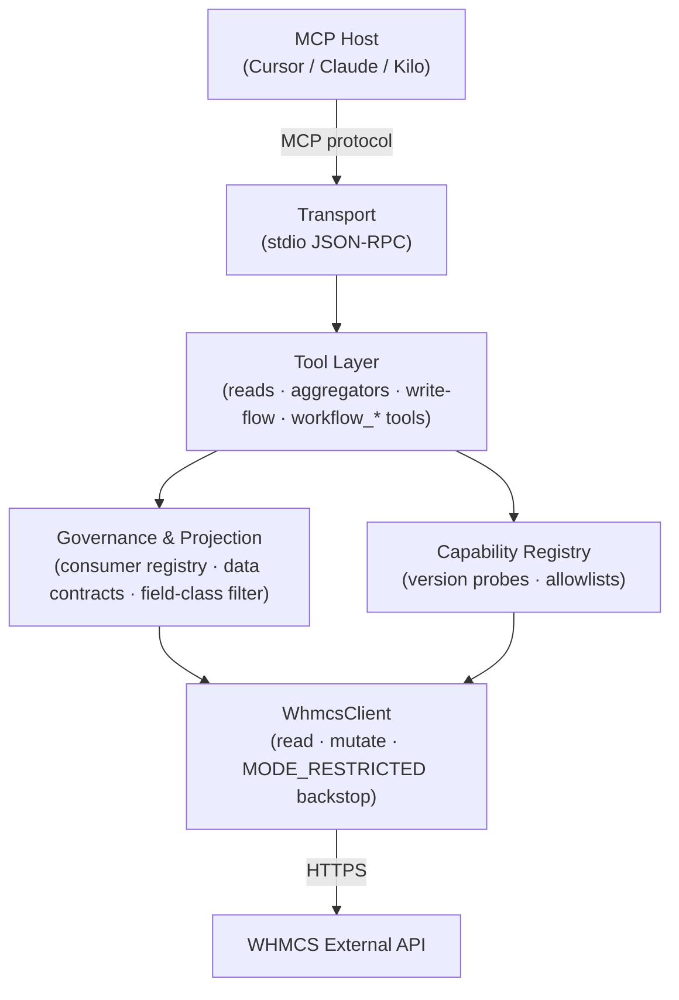

# WHMCS MCP Server

[](https://github.com/yashodhank/whmcs-mcp-server/actions/workflows/ci.yml)
[](https://opensource.org/licenses/ISC)
[](https://nodejs.org)
[](https://www.typescriptlang.org)
[](https://modelcontextprotocol.io)
[](docs/design/controlled-writes-phase-f.md)

A production-ready **Model Context Protocol (MCP)** server that enables AI agents (via Cursor, Claude, or any MCP host) to administrate WHMCS installations through the External API.

For agent and contributor orientation (architecture, governance, write-flow, doc map), see **[AGENTS.md](AGENTS.md)**.

## Architecture



For deeper diagrams — write-flow lifecycle, workflow-tool orchestration, and governance projection pipeline — see [`docs/design/architecture.md`](docs/design/architecture.md).

## Features

- **~70 MCP tools** across several layers (see [Tool Catalog](#tool-catalog)):
  - **Client & billing** — create/search/update clients, invoices, refunds, credits, orders, products
  - **Domains & support** — registration, renewals, transfers, tickets, departments
  - **Governed lists & reporting** — per-client paginated lists, global invoice/service reporting, activity log
  - **Aggregators** — `get_account_360`, `get_billing_snapshot`, `get_renewal_snapshot`, `get_reconciliation_snapshot`, and ten more composite read snapshots
  - **Capability & probes** — `get_capability_matrix`, `get_stats`, transactions, automation log, system refs
  - **Controlled write-flow** — `draft_write_intent` → `validate_write_intent` → `approve_write_intent` → `execute_write_intent` → `get_write_intent`, plus a one-call `write` shortcut. **Sealed by default** — `MCP_MODE=read_only` plus empty `MCP_PROD_WRITE_AUTHORIZED` makes production writes byte-identical to absolute deny.
  - **Workflow tools** (new) — `workflow_dunning_sweep`, `workflow_renewal_risk_triage`, `workflow_ticket_triage_to_resolution`, `workflow_month_end_close`: DRAFT-ONLY composite orchestrators that read WHMCS data, compute candidates, and emit governed write-intent drafts — never execute.

- **9 MCP prompts** — ops-playbook blueprints: `dunning_sweep`, `renewal_risk_triage`, `ticket_triage_to_resolution`, `month_end_close` (with-drafts counterparts to the `workflow_*` tools), plus `month_end_reconciliation`, `phantom_tds_sweep`, `suspend_for_nonpayment`, `new_client_onboarding`, `domain_renewal_review`.

- **7 MCP resources** for passive context:
  - Client summary and activity log
  - Invoice history and ticket thread
  - System activity (admin)
  - Ops playbook (`whmcs://docs/ops-playbook`)
  - WHMCS 8.13 / 9.x compatibility (`whmcs://docs/compat-9x`)

- **Opt-in governance (Phase B)** — consumer registry, data contracts, and projection boundary (`MCP_GOVERNANCE_ENABLED`). See [docs/design/governance.md](docs/design/governance.md).

- **Safety features**:
  - Three operation modes: `read_only`, `simulate`, `full`
  - Sealed by default: empty `MCP_PROD_WRITE_AUTHORIZED` blocks all writes
  - Rate limiting with configurable limits
  - Idempotency protection for high-risk operations
  - Tool allowlist for principle of least privilege
  - Large refund threshold warnings (configurable via `MCP_LARGE_REFUND_THRESHOLD`, default $1000)
  - Unpaid invoice warnings before service termination
  - Failed capture detection before payment retry
  - Input sanitization (HTML tags, control characters)
  - Email/domain normalization and validation (IDN support)
  - Graceful shutdown with cleanup
  - Retry policy with exponential backoff for transient errors
  - `WHMCS_API_URL` HTTPS enforcement (with explicit `WHMCS_ALLOW_HTTP` for local dev only)
  - Configurable client custom-field labels (`MCP_CLIENT_CUSTOM_FIELD_LABELS`)

## Examples

### Quickstart — run over stdio

```bash
# 1. Clone and build
git clone https://github.com/yashodhank/whmcs-mcp-server.git
cd whmcs-mcp-server
npm install && npm run build

# 2. Set credentials
cp .env.example .env
# Edit .env: set WHMCS_API_URL, WHMCS_IDENTIFIER, WHMCS_SECRET

# 3. Launch (stdio — MCP host connects via stdin/stdout)
MCP_MODE=read_only node dist/index.js
```

Add to Cursor (`~/.cursor/mcp.json`):

```json
{
  "mcpServers": {
    "whmcs": {
      "command": "node",
      "args": ["/path/to/whmcs-mcp-server/dist/index.js"],
      "env": {
        "WHMCS_API_URL": "https://billing.example.com",
        "WHMCS_IDENTIFIER": "your_identifier",
        "WHMCS_SECRET": "your_secret",
        "MCP_MODE": "read_only"
      }
    }
  }
}
```

### Read example — `get_account_360`

```json
// Tool call
{ "tool": "get_account_360", "arguments": { "clientid": 42 } }

// Response shape
{
  "client":    { "id": 42, "firstname": "...", "email": "...", "status": "Active" },
  "services":  [ { "id": 101, "name": "cPanel Hosting", "status": "Active", "nextduedate": "2026-08-01" } ],
  "domains":   [ { "id": 5,   "domainname": "example.com", "expirydate": "2026-09-15" } ],
  "invoices":  [ { "id": 200, "status": "Unpaid", "total": "49.00", "duedate": "2026-07-01" } ],
  "tickets":   [ { "id": 88,  "subject": "Domain transfer issue", "status": "Open" } ],
  "risk":      { "overdue_invoices": 1, "suspended_services": 0 },
  "partial_errors": []
}
```

### Write-flow ceremony — sealed by default

Writes are sealed by default (`MCP_MODE=read_only`, empty `MCP_PROD_WRITE_AUTHORIZED`). To perform a governed write in a permitted environment:

```
1. draft_write_intent   → { intent_id: "wfi_abc123", status: "drafted", scope: "service:suspend" }
2. validate_write_intent → { intent_id: "wfi_abc123", status: "validated", checks_passed: true }
3. approve_write_intent  → { intent_id: "wfi_abc123", status: "approved" }   ← human step
4. execute_write_intent  → { intent_id: "wfi_abc123", status: "executed", whmcs_result: { ... } }
```

Low/medium-risk scopes (`client_note:write`, `ticket:create`) auto-approve after validation.
High-risk scopes (`service:suspend`, `billing:credit:add`) always require the explicit
`approve_write_intent` → `execute_write_intent` ceremony and a non-empty `MCP_PROD_WRITE_AUTHORIZED`.

See [docs/design/controlled-writes-phase-f.md](docs/design/controlled-writes-phase-f.md) for the full gate specification.

### Workflow tool — `workflow_dunning_sweep`

`workflow_*` tools orchestrate read + draft in one call. They **never execute** — `executed` is always `false`.

```json
// Tool call
{
  "tool": "workflow_dunning_sweep",
  "arguments": { "overdue_min_days": 30, "limit": 20, "goodwill_credit": false }
}

// Response shape
{
  "workflow": "dunning_sweep",
  "generated_at_note": "computed 2026-06-19T10:00:00Z; DRAFT-ONLY — nothing executed",
  "candidates": [
    { "clientid": 42, "overdue_total": 149.00, "oldest_days_past_due": 47,
      "overdue_invoice_ids": [200, 201], "drafted_intent_ids": ["wfi_abc123"] }
  ],
  "drafted_intent_ids": ["wfi_abc123"],
  "skipped": [],
  "partial_errors": [],
  "executed": false
}
```

The drafted intents (`wfi_abc123`) are retrievable via `get_write_intent` and require the normal
`approve_write_intent` → `execute_write_intent` ceremony before anything reaches WHMCS.

## Documentation

| Topic | Doc |
|-------|-----|
| Agent / contributor guide | [AGENTS.md](AGENTS.md) |
| Doc map (all docs indexed) | [docs/README.md](docs/README.md) |
| Local operator runbook | [docs/runbooks/ai-agent-local.md](docs/runbooks/ai-agent-local.md) |
| Governance & contracts | [docs/design/governance.md](docs/design/governance.md) |
| Controlled writes (Phase F) | [docs/design/controlled-writes-phase-f.md](docs/design/controlled-writes-phase-f.md) |
| Architecture diagrams (D2–D4) | [docs/design/architecture.md](docs/design/architecture.md) |
| Capability probes | [docs/runbooks/capability-probe.md](docs/runbooks/capability-probe.md) |
| Read-only testing | [docs/runbooks/testing-readonly.md](docs/runbooks/testing-readonly.md) |
| Production test program | [docs/runbooks/production-test-program.md](docs/runbooks/production-test-program.md) |
| Local WHMCS stack | [docs/runbooks/local-whmcs-testing.md](docs/runbooks/local-whmcs-testing.md) |
| Agent context reference | [docs/reference/agent-context.md](docs/reference/agent-context.md) |
| App examples (`structuredContent`) | [examples/README.md](examples/README.md) |
| Cursor skills | [docs/reference/cursor-skills.md](docs/reference/cursor-skills.md) |
| GetUsers investigation | [docs/archive/getusers-investigation.md](docs/archive/getusers-investigation.md) |

## Installation

```bash
# Clone or copy the project
cd whmcs-mcp-server

# Install dependencies
npm install

# Build
npm run build
```

## Docker

Build and run with Docker:

```bash
# Build image
npm run docker:build

# Run with docker-compose
npm run docker:run

# Or manually
docker run -it \
  -e WHMCS_API_URL=https://billing.example.com \
  -e WHMCS_IDENTIFIER=your_identifier \
  -e WHMCS_SECRET=your_secret \
  -e WHMCS_ACCESS_KEY= \
  -e MCP_AUTH_TOKEN= \
  -e MCP_ACCESS_MODE=admin \
  -e MCP_MODE=read_only \
  whmcs-mcp-server
```

## Configuration

Create a `.env` file based on `.env.example`:

```bash
cp .env.example .env
```

**Required Variables:**

| Variable           | Description                                               |
| ------------------ | --------------------------------------------------------- |
| `WHMCS_API_URL`    | Your WHMCS base URL (e.g., `https://billing.example.com`) |
| `WHMCS_IDENTIFIER` | API identifier from WHMCS API Credentials                 |
| `WHMCS_SECRET`     | API secret from WHMCS API Credentials                     |

**Optional Variables:**

| Variable             | Default     | Description                                     |
| -------------------- | ----------- | ----------------------------------------------- |
| `MCP_ENV`            | `production` | Env profile: `local`, `staging`, `production`. Layers `.env.<MCP_ENV>` over base `.env`. See [Local WHMCS dev/test](#local-whmcs-devtest). |
| `MCP_MODE`           | `read_only` | Operation mode: `read_only`, `simulate`, `full` |
| `MCP_ACCESS_MODE`    | `admin`     | Access mode: `admin` (full) or `client` (scoped) |
| `MCP_ALLOWED_CLIENT_IDS` | (empty) | Comma-separated client IDs allowed in `client` mode |
| `MCP_AUTH_TOKEN`     | (empty)     | Optional shared secret required on tool calls (`auth_token` param). Not used for resource reads. |
| `MCP_RATE_LIMIT`     | `10`        | Max WHMCS API calls per second                  |
| `MCP_DEBUG`          | `false`     | Enable verbose logging                          |
| `MCP_MAX_PAGE_SIZE`  | `100`       | Maximum pagination size                         |
| `MCP_TOOL_ALLOWLIST` | (empty)     | Comma-separated list of allowed tools           |
| `MCP_LARGE_REFUND_THRESHOLD` | `1000` | Refunds above this amount require `confirm_large_refund: true` |
| `MCP_CLIENT_CUSTOM_FIELD_LABELS` | (empty) | Comma-separated `fieldId:label` overrides for client custom fields |
| `MCP_GOVERNANCE_ENABLED` | `false` | Opt-in consumer-aware projection for reads (see [docs/design/governance.md](docs/design/governance.md)) |
| `MCP_ALLOW_ANON_LLM` | `false` | Allow anonymous `llm_safe_summary` fallback when governance is on |
| `MCP_CONSUMER_REGISTRY` | (empty) | JSON consumer registry (`token_sha256` only — see [docs/reference/consumer-registry.example.md](docs/reference/consumer-registry.example.md)) |
| `MCP_PROD_WRITE_AUTHORIZED` | (empty) | Comma-separated WHMCS actions allowed for production write execution |
| `MCP_WRITE_EXECUTION_AUTHORIZED` | (empty) | Non-prod runtime write allowlist |
| `MCP_WRITE_KILL_SWITCH` | `false` | Emergency block on controlled writes |
| `MCP_WRITE_STRICT_ALLOWLIST` | `false` | Enforce the write allowlist for **all** tiers (legacy posture); default enforces it for high-risk scopes only (low/medium are audit-gated) |
| `MCP_WRITE_STRICT_SCOPES` | `billing:invoice:create` | Comma-separated scopes that always require the write allowlist even if low/medium risk |
| `MCP_WRITE_AUDIT_PATH` | (empty) | Durable audit log path (required when prod writes are allowlisted) |
| `MCP_WRITE_IDEMPOTENCY_PATH` | (empty) | Durable idempotency store path |
| `MCP_WRITE_DAY_AMOUNTS_PATH` | (empty) | Durable daily-cap tally path; set alongside `MCP_PROD_HIGH_RISK_DAILY_CAP` so a restart cannot reset the daily cap |
| `MCP_PROD_HIGH_RISK_PER_ACTION_CAP` | `0` | Per-action cap for high-risk write scopes |
| `MCP_PROD_HIGH_RISK_DAILY_CAP` | `0` | Daily aggregate cap for high-risk writes |
| `WHMCS_ACCESS_KEY`   | (empty)     | Optional WHMCS API access key (for IP restricted setups) |
| `WHMCS_ALLOW_HTTP`   | `false`     | Allow an `http://` `WHMCS_API_URL` (not recommended; credentials sent in clear). Otherwise `https` is required. |

## Tool Catalog

### Client Management

- `create_client` — Create or reuse existing client by email
- `search_clients` — Search clients by name/email/company
- `get_client_details` — Get full client details
- `update_client` — Update client details
- `get_client_contacts` — List contacts for a client
- `get_service_details` — Get detailed service information

### Billing & Financial

- `get_invoice` — Get invoice with line items and transactions
- `mark_invoice_paid` — Mark invoice as paid (write; legacy)
- `record_refund` — Record a refund (WHMCS only, not gateway; write; legacy)
- `capture_payment` — Capture payment on stored method (write; legacy)
- `create_invoice` — Create invoice with line items (write; legacy)
- `add_credit` — Add credit to client account (write; legacy)
- `apply_credit` — Apply credit to an invoice (write; legacy)
- `get_pay_methods` — List payment methods on file for a client
- `get_credits` — Get credit balance for a client
- `get_quotes` — List quotes for a client

### Orders & Products

- `list_products` — List available products
- `accept_order` — Accept a pending order (write; legacy)

### Service Lifecycle

- `suspend_service` — Suspend an active service (write; legacy — prefer `draft_write_intent` scope `service:suspend`)
- `unsuspend_service` — Unsuspend a service (write; legacy)
- `terminate_service` — Permanently terminate (requires `confirm=true`; write; legacy)

### Domains

- `check_domain_availability` — Check if domain is available
- `register_domain` — Register a domain with registrar (write; legacy)
- `renew_domain` — Renew a domain (write; legacy)
- `transfer_domain` — Initiate domain transfer (write; legacy)
- `sync_domain` — Domain sync is cron-based in WHMCS (no External API endpoint)

### Support & Tickets

- `create_ticket` — Create a support ticket (write; legacy)
- `reply_ticket` — Reply to ticket (client/admin/note; write; legacy)
- `get_ticket_departments` — List support departments
- `get_ticket_counts` — Open/awaiting ticket counts by department
- `list_support_statuses` — Available ticket status values
- `get_ticket_thread` — Full ticket thread (also available as resource URI)

### System Reference

- `get_currencies` — List configured currencies
- `list_payment_methods` — Available payment gateway methods
- `get_whmcs_details` — WHMCS version, edition, and system info
- `get_server_health` — Server connectivity and health check
- `get_tld_pricing` — TLD renewal/registration pricing

### Governed Lists & Reporting

- `list_client_services` — Paginated per-client service list
- `list_client_domains` — Paginated per-client domain list
- `list_client_invoices` — Paginated per-client invoice list (honest client-side filters where WHMCS lacks server-side status filters)
- `list_client_tickets` — Paginated per-client ticket list
- `list_client_orders` — Paginated per-client order list
- `get_activity_log` — Activity log with canonical mapping when governance is enabled
- `list_invoices` — Global invoice list for revenue/paying-client reporting
- `list_services` — Global service list

### Capability & Probes

- `list_client_transactions` — Transactions for a client (capability-gated: `GetTransactions`)
- `get_stats` — Global WHMCS stats (clients, invoices, revenue totals)
- `list_users` — User list — **unverified on production matrix** (do not rely without probe; see [docs/archive/getusers-investigation.md](docs/archive/getusers-investigation.md))
- `get_todo_items` — Admin to-do items
- `get_automation_log` — Automation/cron log (capability-gated: `GetAutomationLog`)

### Aggregators

These tools perform multiple WHMCS reads in parallel (fault-isolated) and return a single structured snapshot:

- `get_account_360` — Client identity, services, domains, invoices, orders, tickets, and risk in one call
- `get_billing_snapshot` — Unpaid/overdue/paid/refunded counts+amounts, credit balance, recent outstanding invoices
- `get_support_snapshot` — Department open/awaiting counts + recent client tickets
- `get_renewal_snapshot` — Services and domains due within a configurable window, sorted soonest-first
- `get_domain_portfolio_snapshot` — Per-domain status, registrar, expiry, lock/ID-protection, estimated renewal cost
- `get_accounts_receivable_aging` — Unpaid + overdue invoices bucketed by days-past-due (current / 1–30 / 31–60 / 61–90 / 90+)
- `get_activity_timeline` — Merged client activity log + invoices + orders, newest-first
- `get_reconciliation_snapshot` — Invoice balances/status matched to transactions; flags duplicate-risk, unmatched, and unpaid-with-recent-payment
- `get_provisioning_snapshot` — Services + provisioning orders; automation log capability-gated
- `get_risk_snapshot` — Overdue exposure, suspended services, do-not-renew domains (no contact PII)
- `get_service_lifecycle` — Single-service record, its orders, and automation section (capability-gated)
- `get_revenue_report` — Paid invoices + transactions roll-up over a configurable window
- `get_reconciliation_export` — Normalized invoice-to-transaction ledger suitable for bank / 26AS reconciliation

### Controlled Write-Flow

These tools perform **no WHMCS mutation** until execution passes the full tiered gate. The engine is **sealed by default** — empty `MCP_PROD_WRITE_AUTHORIZED` blocks all writes regardless of `MCP_MODE`.

- `draft_write_intent` — Draft a governed write intent (scope + params + preconditions)
- `validate_write_intent` — Validate a draft: checks scope allowlist, caps, idempotency
- `approve_write_intent` — Human-approval step required for high-risk scopes
- `execute_write_intent` — Execute an approved intent against WHMCS (runs the underlying action)
- `get_write_intent` — Retrieve intent status and audit trail by id
- `write` — One-call tiered shortcut: draft → validate → (auto-approve for low/medium scopes) → execute. High-risk scopes are validated then returned for the explicit `approve_write_intent` → `execute_write_intent` ceremony — never auto-executed.

**Tiered friction**: low/medium scopes (e.g. `client_note:write`, `ticket:create`) are audit-gated and auto-approved; high-risk scopes (e.g. `service:suspend`, `billing:credit:add`) keep the full gate (per-environment allowlist + human approval + monetary caps).

See [docs/design/controlled-writes-phase-f.md](docs/design/controlled-writes-phase-f.md) for scope definitions and the gate specification.

### Workflow Tools (Composite DRAFT-ONLY)

These tools orchestrate multi-step read + draft in a single call. They **always return `executed: false`** — they read WHMCS data, compute candidates, and emit governed `draft_write_intent` drafts. Nothing reaches WHMCS until a human runs the `approve_write_intent` → `execute_write_intent` ceremony on the resulting draft IDs.

- `workflow_dunning_sweep` — Reads overdue invoices + client identity; drafts a `client_note:write` reminder (LOW) per overdue client, and optionally a `billing:credit:add` draft (HIGH, sealed) when `goodwill_credit=true`. Parameters: `overdue_min_days` (default 30), `limit`, `goodwill_credit`.
- `workflow_renewal_risk_triage` — Reads upcoming service + domain renewals; ranks by churn risk (auto-renew off, soonest first); drafts a `ticket:create` reminder (LOW) for at-risk renewals only. Parameters: `horizon_days` (default 30), `limit`.
- `workflow_ticket_triage_to_resolution` — Reads open tickets + each thread; drafts a `ticket:note` (LOW) summarizing findings, and optionally a `ticket:status` change to "Answered" (MEDIUM) for Open/Customer-Reply tickets. Customer-visible replies are flagged for human review — never drafted automatically. Parameters: `deptid`, `limit`.
- `workflow_month_end_close` — Reads transactions + invoices, runs the reconcile analysis, and drafts a `client_note:write` annotation (LOW) per flagged discrepancy (duplicate-risk, unpaid-with-recent-payment). Annotation-only — never drafts any billing/money scope. Parameters: `window_days` (default 30), `limit`.

All `workflow_*` tools return: `{ workflow, generated_at_note, candidates[], drafted_intent_ids[], skipped[], partial_errors[], executed: false }`.

### MCP Prompts (Ops-Playbook Blueprints)

Prompts return a workflow blueprint message — they guide the consuming agent through the relevant read/write tools but never call tools themselves.

**Workflow prompts** (draft-enabled counterparts to the `workflow_*` tools):
- `dunning_sweep` — AR follow-up: find overdue accounts and draft dunning actions via `draft_write_intent`
- `renewal_risk_triage` — Rank upcoming renewals by churn risk; draft reminder tickets for at-risk ones
- `ticket_triage_to_resolution` — Triage the open-ticket queue; draft note/status changes for human review
- `month_end_close` — Full month-end close: reconcile + AR-age + revenue + export; draft `client_note:write` per discrepancy

**Read-only / advisory prompts**:
- `month_end_reconciliation` — Reconcile invoices vs. transactions and report mismatches (no writes)
- `phantom_tds_sweep` — Detect Paid-but-no-arrival (phantom) and unpaid-but-arrived (inverse-phantom) invoices
- `suspend_for_nonpayment` — Evaluate a client for suspension; routes to `draft_write_intent` scope `service:suspend`
- `new_client_onboarding` — Pull the 360 view of a new client and run the onboarding checklist
- `domain_renewal_review` — Surface domains expiring within 30 days with renewal cost

## Authentication & Access Modes

### Shared-Secret Auth (Optional, tool calls only)

If `MCP_AUTH_TOKEN` is set, every tool call must include an `auth_token` parameter matching it. This applies to **tool calls only**.

Example tool call payload:
```json
{
  "auth_token": "your_shared_secret",
  "invoiceid": 123
}
```

**Resources are not authenticated via a URI-query token.** This server speaks MCP over **stdio**, so the process that launches it is the trust boundary. MCP resources are protected by process/transport isolation plus the access-mode and client-scope guardrails. Keep `MCP_AUTH_TOKEN`, `WHMCS_*` secrets, and local config files out of version control.

### Access Modes

`MCP_ACCESS_MODE=client` adds an extra guardrail layer on top of WHMCS admin credentials to prevent cross-client access and admin actions.

**Client mode requires** `MCP_ALLOWED_CLIENT_IDS` to scope all client operations.

**Client mode allows only:**
- `check_domain_availability`, `list_products`
- `get_invoice`, `get_client_details`, `get_service_details` (scoped to allowed client IDs)
- `create_ticket`, `reply_ticket` (client replies only, scoped), `get_ticket_departments`
- Resources: client-summary, invoice-history, ticket-thread, client-log, ops-playbook

**Admin-only tools blocked in client mode:**
- `create_client`, `search_clients`, `update_client`
- `mark_invoice_paid`, `record_refund`, `capture_payment`, `create_invoice`, `add_credit`, `apply_credit`
- `accept_order`
- `suspend_service`, `unsuspend_service`, `terminate_service`
- `register_domain`, `renew_domain`, `transfer_domain`, `sync_domain`
- Resource: system-activity

For **chatbots** and customer-facing integrations, use `client` mode with a strict allowlist and a dedicated WHMCS API role. For **admin workflows** (Cursor IDE, internal ops), use `admin` mode.

### Real-World Isolation Patterns

- **Two MCP instances**: one `client` mode (low-privilege WHMCS API role), one `admin` mode (full role), each with separate credentials and tokens.
- **Per-tenant instances**: run one MCP server per client or tenant and set `MCP_ALLOWED_CLIENT_IDS` to a single ID.
- **Network controls**: restrict WHMCS API access by IP and use `WHMCS_ACCESS_KEY` for IP-restricted setups.
- **Least-privilege API roles**: in WHMCS, define roles with only the exact API actions needed by each MCP instance.

## Operation Modes

| Mode        | Behavior                                                        |
| ----------- | --------------------------------------------------------------- |
| `read_only` | Only read operations work. Write operations return error.       |
| `simulate`  | Write operations log but don't execute. Returns mock responses. |
| `full`      | All operations execute against WHMCS.                           |

## Ops + Dev Deep Dive

### Execution Flow

1. MCP host invokes a tool with validated input schema.
2. Mode and access checks run before any WHMCS API call.
3. Tool maps arguments to WHMCS action + params.
4. WHMCS response is normalized (`array|object|string` edge handling).
5. Output returns as deterministic JSON; failures return structured errors.

### Ops Use Cases

- **Production-safe read operations**: account snapshots, invoice lookups, service/domain/ticket context.
- **Governed write operations**: draft intent → validate → human approval → execute with caps and audit trail.
- **Workflow orchestration**: `workflow_*` tools compute candidates and draft intents in one call; humans approve.
- **Incident triage**: separate transport failures, auth failures, capability gate failures, and business-rule denials.
- **Upgrade compatibility**: WHMCS 9 immutable invoice behavior represented in read/write semantics.
- **Least-privilege deployments**: client-scoped mode with bounded client IDs for support/chatbot scenarios.

### Developer Use Cases

- **Tool-first integration testing**: unit + integration + production test harness (`scripts/mcp-production-test-program.mjs`).
- **Schema-first evolution**: zod-validated contracts for stable agent behavior.
- **Composable tooling**: individual API tools plus composite workflows for reconciliation and snapshots.
- **Environment profiling**: `.env` base with `MCP_ENV` overlays (`.env.local`, `.env.staging`, etc.).
- **Local reproducibility**: full dual-WHMCS disposable stack for end-to-end behavior parity.

### Connected-but-403 Troubleshooting Matrix

`Connected` in MCP only confirms stdio transport health. `403` is usually downstream authorization/policy.

| Symptom | Likely Layer | Fast Check | Fix |
|---|---|---|---|
| All tools fail immediately | MCP auth or server boot config | Verify server starts and tool list is visible | Fix MCP config/env and restart host |
| Some tools work, invoice tools 403 | WHMCS API role/action ACL | Compare `search_clients` vs `get_invoice`/`GetInvoices` | Grant missing WHMCS API actions to credential role |
| Works from one host, fails from another | IP allowlist / egress path | Compare public IPv4/IPv6 for each host | Add both IPs or route through fixed egress |
| `consumer denied` or capability unavailable payload | Governance policy | Check access mode + capability matrix | Update consumer/registry/policy instead of WHMCS |
| Resource reads work, tool calls fail | Tool auth or action gate | Confirm whether `MCP_AUTH_TOKEN` is required | Pass valid `auth_token` in tool calls |

## AI Agent Local Runbook

Use [docs/runbooks/ai-agent-local.md](docs/runbooks/ai-agent-local.md) for a practical operator guide covering:

- where local MCP and WHMCS config files are typically located,
- how to diagnose 403s by layer,
- what to validate before running billing/report tasks,
- and how to keep host-specific configurations aligned.

## Development

```bash
# Run in development mode with hot reload
npm run dev

# Type check
npm run lint

# Build for production
npm run build

# Start production server
npm start
```

## Testing

```bash
# Run all tests
npm test

# Run unit tests only
npm run test:unit

# Run integration tests (requires WHMCS credentials in .env)
npm run test:integration

# Run tests with coverage
npm run test:coverage
```

**Test Safety:**

- Integration tests are READ-ONLY by default
- Write operations are SKIPPED unless `MCP_TEST_WRITE_MODE=true`
- Never run write tests against production data

**Integration tests and 403 / unreachable API:**

- Integration tests call the WHMCS API directly (using `.env` credentials). If the test runner's IP is not in the WHMCS API allowlist, or the API is unreachable, the API may return **403** or a network error.
- In that case, the integration test run **skips** all live API tests with a clear message (e.g. "WHMCS API returned 403; skipping integration tests (check IP allowlist and credentials)").
- To skip integration tests entirely (e.g. in CI where WHMCS is never reachable), set `MCP_INTEGRATION_SKIP=1`.

### Local WHMCS dev/test

For full end-to-end testing (including **write** tools) against a disposable
local WHMCS instead of read-only-against-production, this repo ships a
self-contained dual stack (WHMCS **8.13** @ `localhost:8813` and **9.0** @
`localhost:8890`) via `docker-compose.whmcs-test.yml` + `npm run whmcs:test:*`:

No install wizard: both legs are populated by a non-wizard DB-snapshot restore. Pick **one** seed path:

```bash
npm run whmcs:test:source && npm run whmcs:test:licenses
npm run whmcs:test:up && npm run whmcs:test:license-install
# Primary: prod-derived, PII-scrubbed data into both legs, then run the 8→9 migration:
npm run whmcs:test:seed-prod && npm run whmcs:test:upgrade9
# (or) Clean fallback: pristine fresh-install snapshot, no prod data:
#   npm run whmcs:test:bootstrap
npm run whmcs:test:fixup && npm run whmcs:test:snapshot
# create/regenerate API creds in the local WHMCS admin (admin / DevOnly#2026!secure), then:
cp .env.local.example .env.local      # fill WHMCS_IDENTIFIER / WHMCS_SECRET
MCP_ENV=local npm run build && MCP_ENV=local npm test
```

Prod-derived data and `deploy/whmcs-test/.prodseed/` are gitignored and never committed (the raw dump is deleted right after PII scrubbing).

`MCP_ENV` selects the env profile (`.env.<MCP_ENV>` layered over base `.env`); the `local` profile targets the local stack over http (SEC-005 stays strict for staging/production). Full runbook: **[docs/runbooks/local-whmcs-testing.md](docs/runbooks/local-whmcs-testing.md)**.

### Verifying read-only in Cursor

To confirm read-only tools and resources work against a real WHMCS instance from Cursor:

1. **Prerequisites:** Run `npm run build` so `dist/index.js` exists. Ensure Cursor is using this project's MCP server (e.g. copy [cursor-mcp-config.json](cursor-mcp-config.json) into **Cursor Settings → MCP → Edit config**). If WHMCS has an API IP allowlist, ensure the machine running Cursor is allowed.
2. **Read-only tools to try:** `list_products`, `get_ticket_departments`, `check_domain_availability`, `search_clients` (admin mode), `get_client_details`, `get_invoice`, `get_service_details` (use real IDs from your WHMCS).
3. **Resources to try:** `whmcs://docs/ops-playbook`, `whmcs://clients/{id}/summary`, `whmcs://system/activity` (admin).
4. **Success looks like:** Tool calls return JSON with expected shape (e.g. `clients`, `products`, `invoiceid`) and no stack traces. Resources read without any `auth_token`/`token` and respect `MCP_ACCESS_MODE`. In `read_only` mode, write tools (e.g. `mark_invoice_paid`) return a clear "not available in read_only mode" error.

See [cursor-mcp-config.json](cursor-mcp-config.json) for the reference MCP config and [docs/reference/cursor-skills.md](docs/reference/cursor-skills.md) for recommended Cursor skills.

## Cursor Skills

This project uses [antigravity-awesome-skills](https://github.com/sickn33/antigravity-awesome-skills) with Cursor. Install once with:

```bash
npx antigravity-awesome-skills --cursor
```

Then in Cursor chat use `@skill-name` (e.g. `@mcp-builder`, `@api-security-best-practices`, `@typescript-expert`). Recommended bundles for this repo: **Security Developer** and **Agent Architect** from [docs/BUNDLES.md](https://github.com/sickn33/antigravity-awesome-skills/blob/main/docs/BUNDLES.md). A full curated list with rationale is in [docs/reference/cursor-skills.md](docs/reference/cursor-skills.md).

## Security Considerations

- Never expose the MCP server directly to untrusted clients
- Use `MCP_TOOL_ALLOWLIST` to restrict available tools per deployment
- Start with `read_only` mode and only enable `full` when needed
- Keep `WHMCS_SECRET` and `MCP_AUTH_TOKEN` secure and rotate regularly
- All logs go to stderr (stdout reserved for JSON-RPC)
- Sensitive data (passwords, secrets, CVV) is automatically redacted from logs
- Auth tokens are compared in constant time and are never returned in resource URIs (query params are stripped from responses)

## Technical Details

- **Retry Policy**: 3 retries with exponential backoff (1-10s) for 5xx errors
- **Rate Limiting**: Token bucket algorithm with configurable rate
- **Idempotency**: High-risk operations cached for 60s to prevent duplicates
- **Input Sanitization**: HTML tags and control characters removed from user input
- **Graceful Shutdown**: SIGTERM/SIGINT handlers clean up timers and connections

## Development Standards

This project follows strict AI coding rules to ensure production-grade quality, security, and maintainability.

**Core Principles:**

1. **Correctness & Security** (Sanitize inputs, secure secrets, handle errors explicitly)
2. **Readability & Maintainability** (Clean Architecture, SOLID, DRY)
3. **Idiomatic Style** (Strict TypeScript, consistent formatting)
4. **Performance** (Efficient algorithms, proper resource management)

For detailed rules, see [.cursorrules](.cursorrules) and [.cursor/rules/whmcs-mcp-server.mdc](.cursor/rules/whmcs-mcp-server.mdc).

## License

ISC
