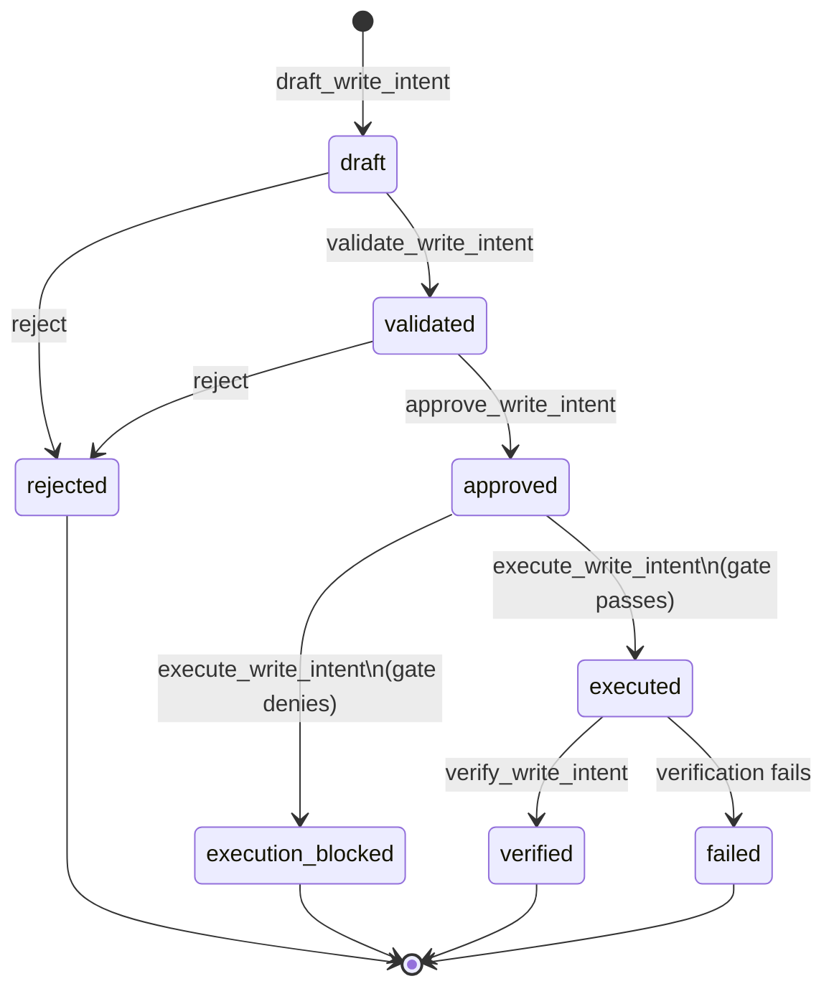
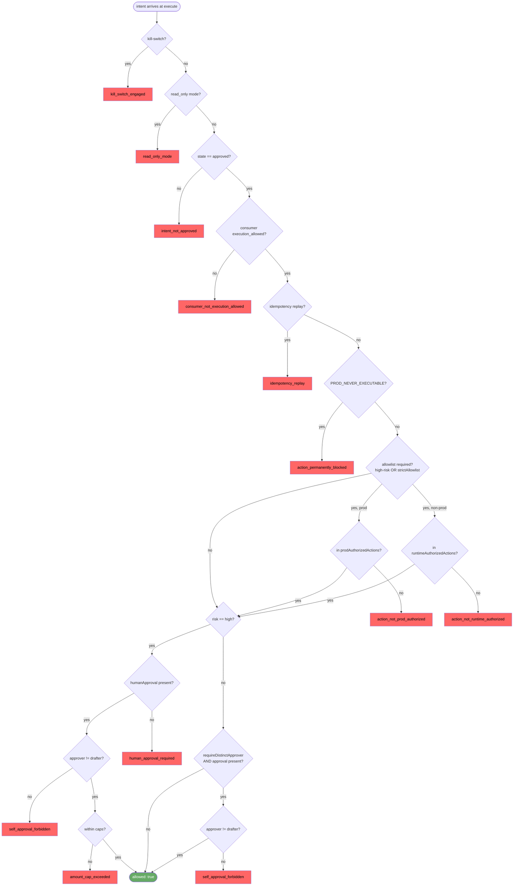
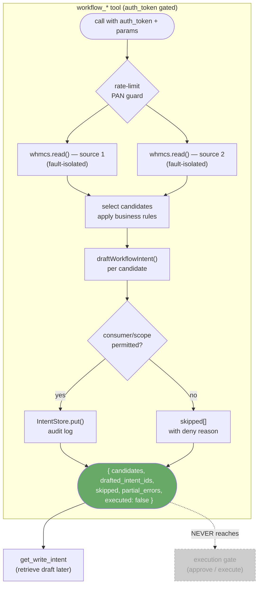
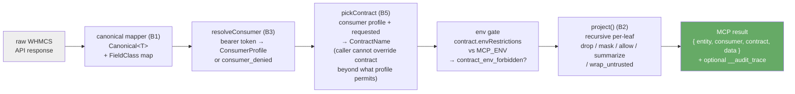

# Architecture: write-flow, workflow tools, and governance

This document covers three internal subsystems in depth, with diagrams grounded in the live source.  For overall system context see the README; for governance policy rationale see [governance.md](governance.md); for the write-flow design decisions see [controlled-writes-phase-f.md](controlled-writes-phase-f.md) and [controlled-writes-phase-i.md](controlled-writes-phase-i.md).

---

## D2 — Write-flow lifecycle and tiered execution gate

### Intent state machine

A `WriteIntent` is a pure, in-memory description of a proposed WHMCS mutation.  Nothing in the write-flow ever calls WHMCS until the intent reaches the `executed` state and passes the gate.  The legal transitions, enforced by `IntentStore.transition()` in `src/write/intents.ts`, are:

```
draft  →  validated  →  approved  →  executed  →  verified
  │            │             │             │
  └──► rejected └──► rejected └──► execution_blocked
                                          └──► failed
```

- **draft** — created by `draft_write_intent`; contains scope, params, risk level, idempotency key, TTL, and a human-readable `projected_effect`.
- **validated** — the operator or an automated check has confirmed the intent's preconditions are satisfied.
- **approved** — a second actor has explicitly approved the intent (human approval is mandatory for `risk=high`).
- **execution_blocked** — the execution gate denied the intent; terminal.
- **executed** — the WHMCS API call was made successfully.
- **verified** — post-execution confirmation that the effect matches the projected effect.
- **rejected** / **failed** — terminal error states at validation or post-execution respectively.



### Tiered execution gate

The execution gate (`src/write/executionGate.ts`) is a pure function — it never contacts WHMCS and never mutates state.  It is the single authorisation boundary that must pass before `WhmcsClient.mutate()` is called.

Gate priority: the **first failing check wins**.

| Step | Check | Deny reason |
|------|-------|-------------|
| 1 | Kill-switch flag is `true` | `kill_switch_engaged` |
| 2 | `mcpMode === 'read_only'` | `read_only_mode` |
| 3 | `intent.state !== 'approved'` | `intent_not_approved` |
| 4 | `consumerWriteCapability !== 'execution_allowed'` | `consumer_not_execution_allowed` |
| 5 | Idempotency replay detected | `idempotency_replay` |
| 6 | Action or scope in `PROD_NEVER_EXECUTABLE` | `action_permanently_blocked` |
| 7a | HIGH risk, or `strictAllowlist`, or scope in `strictScopes` — env=production, not in `prodAuthorizedActions` | `action_not_prod_authorized` |
| 7b | Same tier — non-production, not in `runtimeAuthorizedActions` | `action_not_runtime_authorized` |
| 8a | `risk=high` — no `humanApproval` record | `human_approval_required` |
| 8b | `risk=high` — approver equals drafter | `self_approval_forbidden` |
| 8c | `risk=high` — amount exceeds per-action or daily cap (default 0) | `amount_cap_exceeded` |
| 8d | `risk=low/medium`, `requireDistinctApprover=true`, approval present — approver equals drafter | `self_approval_forbidden` |

**Tiered-friction posture:** LOW and MEDIUM risk intents bypass the allowlist check (steps 7a/7b) unless `strictAllowlist` is set or the scope appears in `strictScopes`.  They are *audit-gated*: execution requires only that the consumer is `execution_allowed`, universal safety checks (steps 1–6) pass, and — for HIGH risk — explicit human approval.  This preserves the sealed-by-default keystone for money and destructive actions while reducing friction for ordinary operational work (notes, tickets, hostname edits, suspend).

**Keystone invariant:** with a fresh deployment (kill-switch off, empty `prodAuthorizedActions`, zero caps), a HIGH-risk production request can only ever reach `action_not_prod_authorized` or an earlier denial.  High-risk production money and destruction is 100% sealed by default.

`WhmcsClient.mutate()` contains an independent `MODE_RESTRICTED` backstop beneath this gate.



The gate is split into two exported functions in `executionGate.ts`:

- `preAuthorizeIntent` — steps 1–7 (all non-monetary gates); shared with the `service:price_restore` batch executor so identical gates are never re-implemented.
- `defaultExecutionAuthorizer` — calls `preAuthorizeIntent`, then enforces step 8 (monetary/approval tier).

---

## D3 — Workflow-tools orchestration

### What the `workflow_*` tools do

The four composite workflow tools (`workflow_dunning_sweep`, `workflow_renewal_risk_triage`, `workflow_ticket_triage_to_resolution`, `workflow_month_end_close`) are the server-side twins of the power-user prompts of the same names.  They perform the orchestration the prompts only describe.

**DRAFT-ONLY invariant** (the whole point): these tools never call `whmcs.mutate`, never validate-to-approved, never approve, and never reach the execution gate.  Every result carries the literal `executed: false`.

### Orchestration pattern

Each tool follows the same three-phase pattern:

1. **Fan-out reads** — call `whmcs.read(...)` once per data source, fault-isolated via `safeSection`.  A single failed read records a `partial_errors[]` entry; it never aborts the sweep.  The workflow continues with whatever data was successfully fetched.

2. **Candidate selection** — apply the same ranking/filtering logic the matching prompt describes (overdue threshold, renewal horizon, ticket status heuristic, reconciliation discrepancy detection).

3. **Draft intents** — call `draftWorkflowIntent(req)` (from `writeFlow.ts`) for each candidate.  This reuses the existing governance layer (`resolveWriteConsumer` + `assertWriteScopeAllowed`) and the shared `store`/`audit` singletons — so drafts from workflow tools are visible to `get_write_intent`.  A candidate whose consumer/scope is not permitted is `skipped[]` with the deny reason, never drafted and never a hard failure.



### Sealed-by-default in the workflow context

Because workflow tools only ever draft, the sealed-by-default posture of the execution gate is irrelevant to them at call time.  A human operator must separately call `validate_write_intent → approve_write_intent → execute_write_intent` to advance any of the drafted intents through the gate.  This provides a natural review window for bulk-generated intents before any mutation reaches WHMCS.

### Tool-to-scope mapping

| Tool | Drafts scope | Risk |
|------|-------------|------|
| `workflow_dunning_sweep` | `client_note:write` | LOW |
| `workflow_dunning_sweep` (goodwill_credit=true) | `billing:credit:add` | HIGH (sealed) |
| `workflow_renewal_risk_triage` | `ticket:create` | LOW |
| `workflow_ticket_triage_to_resolution` | `ticket:note` | LOW |
| `workflow_ticket_triage_to_resolution` | `ticket:status` | MEDIUM |
| `workflow_month_end_close` | `client_note:write` | LOW |

HIGH-risk scopes drafted by workflow tools (`billing:credit:add`) remain fully sealed by default: they require the full execution gate ceremony including human approval and explicit cap configuration before they can execute.

---

## D4 — Governance projection pipeline

### Purpose

The governance projection pipeline is the single output boundary for all governed read tools.  Raw WHMCS data is never emitted directly; it is always canonicalised, then filtered and transformed by the pipeline before reaching an MCP consumer.

The pipeline is implemented across three files:

- `src/governance/pipeline.ts` — the top-level wiring (B5); consumer resolution, contract selection, and output formatting.
- `src/governance/projection.ts` — the pure recursive field projector (B2); the only place fields are dropped, masked, or wrapped.
- `src/governance/consumers.ts` — bearer-token → `ConsumerProfile` resolution (B3).

### Pipeline stages



### Field classification and projection actions

Every leaf in the canonical data has a `FieldClass` (set by the B1 canonical mapper).  An unmapped leaf is treated as the most-restrictive class and dropped — no raw field is ever silently made public.

The `DataContract` policy maps each `FieldClass` to one of five projection actions:

| Action | Effect |
|--------|--------|
| `allow` | Emit value as-is |
| `drop` | Omit field entirely |
| `mask` | Partial reveal (class-specific: email → `a***@d***`, phone → `******1234`, name → `First L.`, address → first token, tax → `****1234`) |
| `wrap_untrusted` | Emit `{ untrusted: true, value }` |
| `summarize` | Emit `{ summary, length, truncated }` (strings only; non-strings drop) |

Container nodes (objects, arrays) with their own `FieldClass` are gated by that class' action: `allow` causes recursion into children (which are still individually projected); any other action drops the entire container.  A container with no class is structural — the projector recurses without any gate.

### Consumer resolution and contract selection

`resolveConsumer()` maps the bearer token from the MCP call's `auth_token` field to a `ConsumerProfile`.  The profile specifies:

- `defaultContract` — the contract used when the caller supplies no explicit contract name.
- `allowedContracts` — the set of contract names the consumer is permitted to request.
- `writeCapability` — whether the consumer can reach the execution gate (`execution_allowed`) or is read-only.

`pickContract()` enforces that the resolved contract is always consumer-governed, never caller-arbitrary: a requested contract name is honoured only if it appears in the consumer's `allowedContracts`; otherwise the `defaultContract` is used.  The registry is loaded from the environment (`MCP_CONSUMER_REGISTRY` or `MCP_CONSUMER_REGISTRY_FILE`) and cached with a configurable TTL (default 60 s, overridable via `MCP_REGISTRY_CACHE_TTL_MS`) so that credential rotations are picked up without a process restart.

### Audit trace

When `MCP_AUDIT_TRACE=1` is set, `projectWithTrace()` is used in place of `project()`.  It runs the identical per-node decision but additionally emits an `AuditTraceRecord[]` containing, for each field: source path, output path, field classification, projection decision, rule ID, reason, and value state.  The trace is value-free by construction — it records decisions, not data.  The `__audit_trace` key is present in the governed result only when the flag is set; the payload is byte-identical to the non-tracing variant otherwise.

### Governance-off passthrough

When `MCP_GOVERNANCE_ENABLED` is not set, `applyGovernanceOrLegacy()` returns the pre-governance payload verbatim.  The `structuredContent` key is mirrored from the legacy object so that MCP runtimes validating against the declared `outputSchema` (e.g. Kilo) receive a valid response even in the passthrough path.

---

## Cross-references

| Topic | Document |
|-------|----------|
| Write-flow design rationale and six-tool ceremony | [controlled-writes-phase-f.md](controlled-writes-phase-f.md) |
| Phase I write-flow recommendation (predecessor design) | [controlled-writes-phase-i.md](controlled-writes-phase-i.md) |
| Governance policy, contracts, and field classifications | [governance.md](governance.md) |
